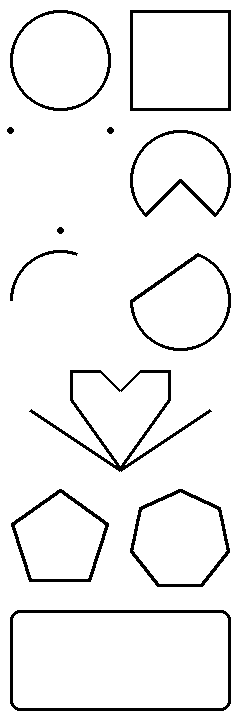
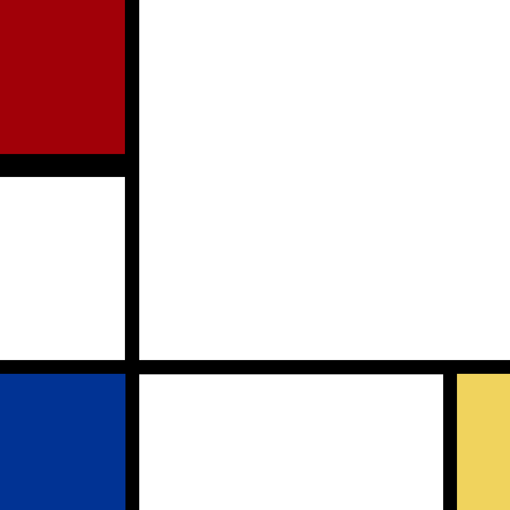

# Graphics

I'm using the PIL python library to plot these assignments,
if that changes I'll declare it on the corresponding section.

---

## One with everything

Decided to plot every graphics primitive at my disposal in a 
simple BW palette and width 3 lines.  
This was a relatively easy exercise, with the exception of 
regular polygons. For some reason PIL doesn't allow you to 
plot them with a line width other than 1. I had to 
improvise a hack where I actually plot them 9 times, wiggling them 
around to mimic a thicker line. Never would I have guessed 
this exercise would have taught me something.

## Coding Mondrian

Downloaded Mondrian's _Composition I_, sampled its colors 
and measured the rectangles' sides in pixels, then used a 
function to map them onto an output canvas.

## Quadrilateral zoo

This assignment is trivial with PIL's `line` function, so 
I skipped it.

## Coding _Stadia II_

In progress
